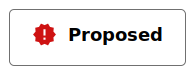

# Article Preview

Article expands into a <a href="https://material.io/components/sheets-bottom">Material design bottom-sheet</a> helps user read article and preview article. 

Components are labeled with numbers with explanations below. Desktop version will soon be added here.

1. Blog Home ( Article is previewed in an overlay )
2. Top Bar to indicate Remote Web Page - Like Chrome Preview Page
3. Blog opened on the provider's ( Remote's ) website

Top appbar inside bottom sheet shows a lock based on connection HTTP protocol 
the article contains a base64 encoded slug which the server resolves into a remote-url which client opens inside an iframe component which is sandboxed

---

Copyright (c) - 2021  - Kabeer's Network LLC
